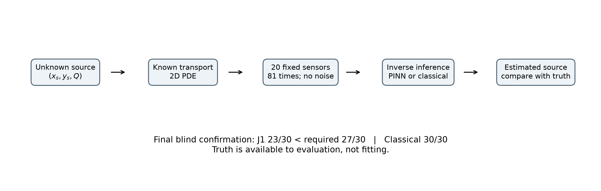

# InverPINN

### Diagnosing Source-Strength Bias in Physics-Informed Neural Networks for Sparse Pollution Source Inversion

InverPINN asks how reliably a physics-informed neural network (PINN) can infer an unknown pollution source from sparse concentration measurements. In a controlled, blind synthetic benchmark, the PINN often localized sources accurately but retained source-strength bias; classical PDE-constrained inversion recovered all 30 sources using the same observations.

[Manuscript](paper/manuscript.md) · [Documentation](docs/README.md) · [Figure gallery](docs/figures.md) · [Reproduce the paper](#reproducing-the-paper)

## Final blind benchmark

| Method | Joint recovery | Median localization | Median Q error | Median field L2 |
| --- | ---: | ---: | ---: | ---: |
| J1: variable-projection PINN | 23/30 (76.67%) | 0.005574 | 5.975% | 7.423% |
| Classical inverse | 30/30 | 0.001111 | 1.218% | 1.507% |

> **J1 failed the preregistered reliability threshold: 27/30 recoveries (90%) were required.**

Joint recovery requires localization error ≤ 0.08 **and** relative source-strength error ≤ 20%. J1's recovery rate has a 95% Wilson interval of 59.07–88.21%. Localization is in synthetic domain units, not kilometres. [Complete results and the B_revised control](paper/generated/tables/table3_final_benchmark.md).



*Existing study schematic. The controlled research is complete; this repository preserves the failed confirmation, not a deployed pollution detector.*

## Why this problem matters

Estimating where pollution originates is harder than predicting concentration: sparse sensors may admit misleading source estimates even when a model fits observations and obeys physical constraints. Almaty motivates the question, but the experiments here isolate the inverse problem using known synthetic sources—not real emitter attribution.

## How InverPINN works

Unknown source → advection–diffusion transport → sparse virtual sensors → inverse model → estimated source location and strength.

```math
\frac{\partial C}{\partial t}
+u\frac{\partial C}{\partial x}
+v\frac{\partial C}{\partial y}
=D\nabla^2 C+S
```

`C` is concentration; `u,v` are wind velocity; `D` is diffusion; `S` is the source. The tested source is one Gaussian with unknown position and peak intensity `Q`, and known width. `Q` is **not** area-integrated emissions. [Units and mathematical details](paper/manuscript.md).

- **PINN:** a PyTorch neural concentration field is fitted to sensor data and the PDE residual while inferring source parameters. The revised field enforces nonnegativity and zero initial/boundary concentration.
- **J1:** a PINN that analytically profiles `Q` from the squared PDE residual; the neural field and source location still undergo optimization. This is not an observation-optimal amplitude estimate.
- **Classical inverse:** a numerical PDE solver and low-dimensional source-parameter optimization directly minimize sensor mismatch. It has no neural concentration field.

## Main findings

- **Localization was often accurate:** final J1 median error was 0.005574, but joint recovery still failed in seven cases.
- **Strength bias persisted:** J1 underestimated `Q` in 28 cases and overestimated it in two.
- **Physical admissibility was insufficient:** negative fraction, maximum boundary violation and maximum initial-condition violation were all zero for J1; source errors remained.
- **The observations supported better recovery:** the classical method recovered 30/30 on the same sensors, weakening an explanation based solely on insufficient observations in this setting.
- **Profiling improved, but did not resolve, PINN recovery:** J1 improved on B_revised's 21/30 recoveries and median errors, without reaching final confirmation. [Paired evidence](paper/generated/tables/paired_effects.csv).

## Experimental design

One Gaussian; known width `σ = 0.08`; known wind `(0.35, −0.15)` and diffusion `D = 0.005`; source coordinates in `[0.25, 0.75]²` and `Q` in `[0.8, 1.4]`. The domain is `[0,1]²`, with zero initial concentration and zero Dirichlet boundaries. Twenty fixed sensors observe 81 times over `[0,0.8]`, with zero added noise.

The research proceeded in stages:

1. Validate the numerical PDE solver with analytical solutions and refinement.
2. Generate high-accuracy, 641×641 synthetic reference fields.
3. Sample sparse virtual sensors.
4. Fit inverse PINNs on separate development scenarios.
5. Evaluate frozen models on untouched source scenarios.
6. Diagnose failures through observability and classical inversion.
7. Test analytical source-strength profiling on new development data.
8. Run a final preregistered, 30-scenario blind confirmation.

Historical and final sets are not pooled. All final failures and three numerical-reference quality flags remain in the report. [Protocols and stage reports](docs/README.md#scientific-methodology).

## Repository structure

```text
InverPINN/
├── configs/          Physical settings, protocols and frozen model recipes
├── docs/             Methodology, historical reports and reader guides
├── paper/            Manuscript, sealed evidence, figures and tables
├── presentation/     A1 poster, editable slides, PDF slides and speaker notes
├── scripts/          Reporting and historical experiment entry points
├── src/inverpinn/     Physics, data, models, training, evaluation, visualization
├── tests/            Scientific tests and isolated report/document checks
├── data/             Raw, processed and synthetic data (generated files ignored)
├── results/          Full research outputs (ignored; not in a clean clone)
├── artifacts/        Local preservation/audit records (ignored)
├── experiments/      Reserved experiment organization
└── notebooks/        Optional exploration; not needed for paper reproduction
```

Physics and residual definitions are separate from neural-network code. `data/raw/` preserves originals, `data/processed/` holds derived inputs, and `data/synthetic/` holds generated datasets. Existing real-data utilities are outside the validated study. [Engineering rules](AGENTS.md) · [Contributor guide](CONTRIBUTING.md).

## Quick start

Start with the report, not training. From a checkout's root, use **Python 3.13** for the pinned reporting environment (the core package declares Python ≥ 3.11). On macOS/Linux:

```bash
python -m venv .venv-report
source .venv-report/bin/activate
python -m pip install -r paper/requirements-report.txt
python -m pip install --no-deps -e .
python -c "import inverpinn; print('InverPINN import OK')"
python scripts/build_paper.py --verify-only
```

`--no-deps` installs package metadata for the import check without downloading PyTorch or the full scientific stack. This is a **report-only environment**, not a training installation. Dependency installation needs internet; the checks and report build are offline. On Windows, use the virtual environment's `Scripts/Activate.ps1` activation script.

## Reproducing the paper

### From bundled evidence — the primary path

```bash
python scripts/check_docs.py
python -m pytest tests/test_paper_reporting.py tests/test_repository_docs.py -q
python scripts/build_paper.py --output-dir paper/reproduced_github_check
```

The build reads the committed evidence, verifies hashes and pairing, and recreates nine figures (PNG/PDF), four main tables and machine-readable CSV/JSON results. It normally takes seconds after installation, uses only a few megabytes of evidence/output, and **does not train, infer from checkpoints or solve a PDE**. It refuses an existing output directory; choose a new name for a second build.

The lightweight tests also render a report. Font rendering and execution provenance can vary by platform; recorded numerical results are checked. [Canonical outputs](paper/generated/README.md) · [Environment, hashes and limitations](docs/reproducibility.md).

### Formal PDF, poster and delivery checks

The final PDFs are already committed. To reproduce them in a **new** directory:

```bash
python -m pip install -r paper/requirements-delivery.txt
python scripts/build_final_pdf.py --output-root artifacts/pdf_reproduction
python scripts/check_final_delivery.py
python -m pytest tests/test_final_delivery.py -q
```

Without `--output-root`, the PDF builder targets `paper/InverPINN_Paper.pdf` and
`presentation/InverPINN_Poster.pdf`; it refuses to overwrite existing deliverables.
It only typesets the preserved manuscript and figures. [Slide sources and authoring
runtime limitations](presentation/README.md) · [Complete delivery inventory](docs/FINAL_DELIVERABLES.md).

### Full scientific experiments — archive-dependent, not a quick start

The ignored research archive is approximately 11 GB, plus generated input data. A clean checkout does not contain every training history, checkpoint or full reference field. Complete experimental reruns require that archive, compatible scientific dependencies and attention to historical execution locks; no public archive DOI is claimed.

Do **not** substitute the historical `scripts/reproduce_paper.py`: it launches training and sweeps, not this report-only build. [Full-archive boundary](docs/reproducibility.md#reference-and-full-archive-boundary).

## Key figures

[Browse the eight-figure gallery](docs/figures.md):

- [Numerical convergence](paper/generated/figures/02_numerical_convergence.png)
- [True and inferred source locations](paper/generated/figures/03_source_locations.png)
- [Source-strength bias](paper/generated/figures/04_source_strength.png)
- [Error distributions](paper/generated/figures/05_error_distributions.png)
- [Mechanically selected failure](paper/generated/figures/08_failure.png)

## Limitations

The tested setting is correctly specified, two-dimensional, single-source and zero-noise, with known constant meteorology and one sensor geometry. Numerical truth has discretization error; three final reference estimates exceeded the 1% target and were retained. Richardson estimates are not certified bounds. Thirty scenarios and one primary optimization seed do not establish general reliability or a unique causal mechanism for the PINN's bias. [Complete limitations](paper/generated/tables/table4_limits.md).

### What this project does not claim

- Verified real-world emitter attribution in Almaty.
- Validated multiple-source recovery or sensor-noise robustness.
- Validated robustness to uncertain meteorology.
- General superiority of PINNs over classical inverse methods.

## Paper

Read the [formal paper PDF](paper/InverPINN_Paper.pdf), [source manuscript](paper/manuscript.md), [supplement](paper/supplement.md) and [scientific audit](docs/final_scientific_audit.md). This is a research manuscript, not a claim of peer-reviewed publication. For a less technical introduction, see the [project summary](docs/project_summary.md). The [final deliverables](docs/FINAL_DELIVERABLES.md) include a poster, slides and communication materials.

## Citation

Khadis Aidyn. *InverPINN: Diagnosing Source-Strength Bias in Physics-Informed Neural Networks for Sparse Pollution Source Inversion*. Software, historical package version 0.0.0. See [CITATION.cff](CITATION.cff). No DOI, venue or affiliation is asserted.

## License

No license has been selected or included. Public availability should not be interpreted as a reuse license; contact the repository owner to clarify permission.

## Research integrity

Final performance thresholds were frozen before blind evaluation. Failed scenarios were retained; J1 did not meet the preregistered 90% recovery criterion. Development stopped rather than retuning against the consumed benchmark. The [evidence manifest](paper/evidence/manifest.json) records hashes, and the [changelog](CHANGELOG.md) separates the research freeze from presentation changes.
