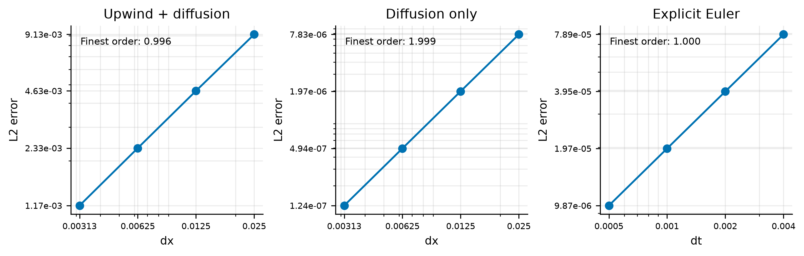
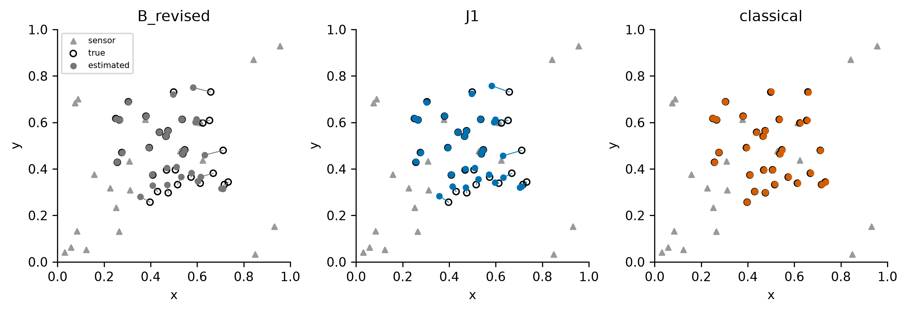
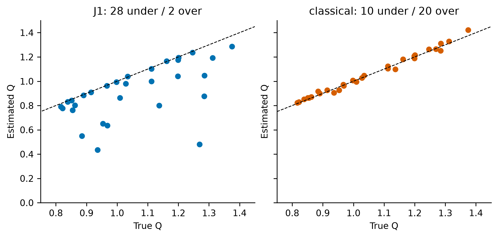
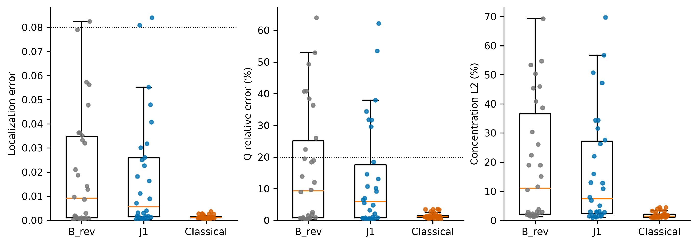
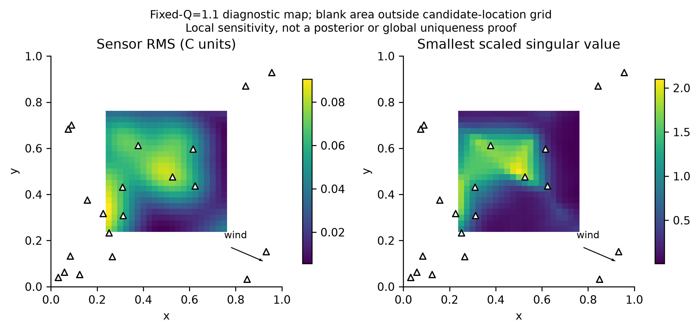
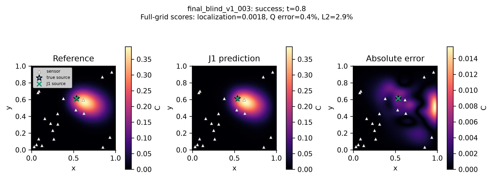
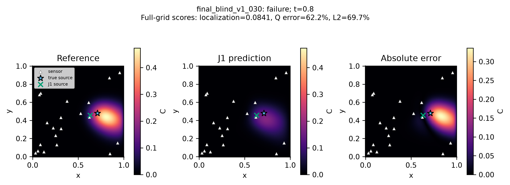

# InverPINN: Diagnosing Source-Strength Bias in Physics-Informed Neural Networks for Sparse Pollution Source Inversion

## Abstract

Recovering an emission source from sparse concentration measurements requires both an informative observation network and a reliable inverse method. We evaluated physics-informed neural networks (PINNs) for a controlled two-dimensional, transient advection–diffusion problem with one stationary Gaussian source, known transport coefficients, 20 fixed sensors and no added measurement noise. Manufactured-solution tests and grid refinement preceded inverse experiments using a 641 × 641 numerical reference. Initial PINNs exhibited negative concentrations and underestimated source strength. Exact nonnegativity and homogeneous initial/boundary constraints removed those physical violations without eliminating recovery failures. Conditional source-strength estimation and classical joint inversion demonstrated recoverability under the tested observation design. A differentiable variable-projection PINN, J1, analytically eliminated source amplitude from the PDE residual. On 30 new, protocol-frozen confirmation scenarios, J1 achieved median localization error 0.005574, source-strength relative error 5.975%, and concentration relative L2 error 7.423%. However, it recovered only 23/30 sources jointly, below the preregistered requirement of 27/30, and therefore **failed final confirmation**. Source strength remained underestimated in 28/30 cases. Classical PDE-constrained inversion recovered 30/30, with corresponding median errors 0.001111, 1.218%, and 1.507%. These results distinguish physical admissibility from inverse reliability: analytical profiling improved the tested PINN but did not close its recovery gap. The conclusions apply to this synthetic source family and observation geometry, not real-world emitter attribution or a universal ranking of inverse methods.

## 1. Introduction

Pollution monitors measure concentrations after transport, not emissions at their origin. Working backward therefore requires assumptions about how a source, wind and diffusion generate the measured field. Almaty motivates the application through questions about winter pollution, mountain–valley transport and uncertain source contributions; published work documents its spatial and temporal air-pollution variability [1]. Here, sparse monitoring is a controlled experimental condition, not a claim that our 20 synthetic sensors reproduce the city's network. No Almaty measurements, terrain, atmospheric inversion events or identified emitters enter the experiments.

Spatial interpolation estimates a field between observations, while forecasting predicts its evolution. Neither task alone identifies a generating source. Classical PDE-constrained inversion searches source parameters through a numerical transport solver. PINNs instead represent concentration with a differentiable neural field and penalize departure from a governing equation [2]. This makes them attractive for combining sparse measurements with physical assumptions, but a small training objective need not imply an accurate inverse solution. Composite-loss gradient imbalance and failures on transport-type problems have been documented [3,4]. Hard trial-solution constraints can enforce boundary conditions by construction [5], but their effect on inverse accuracy still requires testing.

Our question is: **How reliably can PINNs recover an unknown source's location and strength from sparse concentration measurements, and what limits their performance relative to classical PDE-constrained inversion?** The contributions are a numerically checked benchmark, a separation of physical admissibility from source recovery, an observation-based diagnosis of persistent PINN source-strength bias, and a final unsuccessful confirmation of an analytical amplitude intervention. We do not claim a new Gaussian transport model or invention of variable projection [6]. The contribution is the controlled evidence and its limitations.

## 2. Methods

### 2.1 Controlled transport problem

For concentration C(x,y,t), we solve

\[
 C_t+uC_x+vC_y=D(C_{xx}+C_{yy})+S(x,y),\qquad
 S=QG=Q\exp\!\left[-\frac{(x-x_s)^2+(y-y_s)^2}{2\sigma^2}\right].
\]

Time changes concentration; wind carries it in the x and y directions; diffusion spreads it; the source adds it. The residual used by the PINN is **C_t + uC_x + vC_y − D(C_xx+C_yy) − QG**. The plus signs on the advective derivatives and minus signs on diffusion and source follow by moving the right-hand side to the left. PyTorch automatic differentiation supplies the five derivatives; analytical-function tests are part of the frozen scientific test suite.

The domain is [0,1]², time is [0,0.8], u=0.35, v=−0.15, D=0.005 and σ=0.08. Initial concentration is zero, and concentration is fixed at zero on all four edges. These are absorbing Dirichlet boundaries, **not** no-flux walls or a general open-outflow atmospheric boundary model. Nonnegative forcing and a monotone reference scheme preserve nonnegativity. True source coordinates lie in [0.25,0.75]² and Q lies in [0.8,1.4]. Inference locations may range over the full unit square.

The units are synthetic: x,y,σ have length units L, t has T, u,v have L/T, D has L²/T, and Q has concentration/time units. Q is a **peak source intensity**, not an integrated emission rate. Its integral on the infinite plane would be 2πσ²Q; the bounded domain truncates that integral. We do not map these units to metres, seconds, µg/m³ or a real emission inventory. [Table 1](generated/tables/table1_physics.md) gives the physical/numerical parameters.

### 2.2 Numerical reference and observations

The numerical solver uses forward Euler time stepping, first-order upwind advection and centered second-order diffusion. A sufficient explicit monotonicity condition is

\[
 \Delta t\left(\frac{|u|}{\Delta x}+\frac{|v|}{\Delta y}
             +\frac{2D}{\Delta x^2}+\frac{2D}{\Delta y^2}\right)\le1.
\]

The code rejects violations. Stability alone does not establish reference accuracy. Manufactured solutions isolate spatial advection–diffusion, diffusion alone, and temporal error. The spatial test uses C=t sin(πx)sin(πy) with its analytical forcing. The temporal test uses C=(exp(t)−1)x(1−x)y(1−y), zero wind and exact centered differences of the quadratic spatial term. Step-halving checks separate temporal contamination from spatial refinement.

The old 81² reference was rejected for accuracy, not instability: a calibration Gaussian case had an approximately 5.397% Richardson-estimated final-field error. The adopted reference uses **641²**, Δx=Δy=0.0015625, Δt=0.00003125 and 25,600 updates. Refinements at 161²/0.0005 and 321²/0.000125 support scenario-specific Richardson estimates. These are asymptotic estimates, **not certified mathematical bounds**. Known source truth is exact; numerical concentration truth is approximate.

Twenty sensors have identical fixed coordinates for all final methods and cases. Bilinear spatial sampling supplies observations at 81 equally spaced times from 0 to 0.8. Added measurement noise is zero. Full fields at t=0.1,0.2,0.4,0.8 support independent reconstruction evaluation. The 1,620 sensor-time values include the prescribed zero initial observations. No dense reference field or true source parameter is supplied to fitting. The exact geometry is in the bundled [sensor coordinates](evidence/final/sensor_geometry.json).

### 2.3 Neural field, source and objective

The field network has three 64-unit tanh hidden layers, three inputs (x,y,t), and one scalar output. Coordinates are linearly normalized to [−1,1]. In the revised field,

\[
 C_\theta(x,y,t)=16x(1-x)y(1-y)\frac{t}{0.8}\,
 \operatorname{softplus}(f_\theta(x,y,t)).
\]

This enforces nonnegativity on the domain, zero initial concentration and zero concentration at all boundaries. It does not guarantee the correct source or solution in the interior. Source location uses sigmoid-transformed parameters initialized at (0.5,0.5). The frozen B_revised model uses a separately optimized softplus Q initialized at 1.1.

Writing MSE as the arithmetic mean over the relevant points, the objective is

\[
 L=\frac{10}{C_*^2}\operatorname{MSE}(C_\theta-z)
  +\frac{T_*^2}{C_*^2}\operatorname{MSE}(R_0-QG)
  +\frac{1}{C_*^2}\operatorname{MSE}(C_\theta|_{t=0})
  +\frac{1}{C_*^2}\operatorname{MSE}(C_\theta|_{\partial\Omega}),
\]

where R₀=C_t+uC_x+vC_y−D(C_xx+C_yy), C*=0.88 and T*=0.8. The last two losses vanish identically under the hard field parameterization. At fixed θ, data loss has **zero direct gradient with respect to x_s,y_s,Q**; source information reaches the neural field/source optimization through the PDE term. In particular,

\[
 \partial_Q L_{\rm PDE}=-2\frac{T_*^2}{C_*^2}\langle G,R_0-QG\rangle.
\]

A neural field can fit the sensors yet be only approximately consistent with the numerical field produced by its inferred source. This motivates the field/source-compensation hypothesis, but does not establish a unique cause of optimization failure.

### 2.4 J1: analytical amplitude projection

For fixed field and location, let a weighted PDE objective be proportional to Σ_i w_i(R₀,i−QG_i)², with nonnegative weights. Differentiating with respect to Q gives

\[
 Q_{\rm unconstrained}^*=\frac{\sum_i w_iG_iR_{0,i}}{\sum_i w_iG_i^2}.
\]

With positive denominator the nonnegative optimum is max(0,Q*). The implementation approximates the strictly positive boundary by the smallest positive normal value of the working dtype; when the unconstrained optimum is nonpositive, the open Q>0 domain has a boundary infimum rather than an attained zero minimum. Degenerate/nonfinite denominators raise errors. The actual batches have uniform weights, so common MSE and PDE-loss scale factors cancel. Sums accumulate in float64 and the result returns to the float32 field calculation.

J1 uses **differentiable variable projection**, not a truth-dependent update. Q is not an independent Adam parameter. Substituting its exact batch optimum defines a reduced objective in θ,x_s,y_s; at interior optima the envelope theorem cancels the derivative-through-Q term. Projection occurs each update, followed by a declared terminal Q-only profile on 8,192 fitting points. These terminal points are not the independent physical-diagnostic points. Minimizing PDE residual over Q is not the same as minimizing observation mismatch through a forward solver. Profiling can therefore leave bias in an imperfect field. The legacy recipe's softplus label does not describe J1's amplitude algorithm; the frozen configuration explicitly identifies Q as an analytical profile buffer.

Both neural methods use 12,000 Adam updates, learning rate 0.001, default β=(0.9,0.999), ε=10⁻⁸, no scheduler or weight decay. Each update resamples 512 sensor-time records with replacement and 512 uniform interior points; 128 initial and 64 points per boundary edge are also generated. CPU float32, one PyTorch thread and deterministic algorithms are used. Primary initialization seed is 42, sampling seed 43 and terminal profile seed 44. No case-specific tuning, truth-based restart or additional updates occur. [Table 2](generated/tables/table2_methods.md) and the byte-preserved configurations specify the recipes.

### 2.5 Classical inversion and observability diagnostics

The classical method is **not a PINN**. On a 201² grid with Δt=0.00025, a unit-amplitude forward solve at candidate location produces sensor response h(x_s,y_s). Linearity gives the observation-optimal nonnegative amplitude

\[
 Q_{\rm obs}^*=\max(0,h^Tz/(h^Th)).
\]

SciPy bounded nonlinear least squares searches location using all observations. A 21² candidate-location bank in [0.25,0.75]² supplies three observation-selected starts separated by at least 0.08. Location bounds are [0,1]²; each start has max_nfev=60 and frozen tolerances. The finite result with smallest sensor MSE is retained, without inspecting truth. The reference and inference grids differ, reducing same-grid inverse crime, but both use the same transport model and discretization family. This is not an independent atmospheric validation.

Conditional-Q diagnostics deliberately use true location and are labeled **oracle diagnostics**, not an inference method. Local observability uses a finite-difference sensor-response Jacobian scaled by parameter ranges (0.5,0.5,0.6) and concentration scale 0.88. Rank and singular values quantify local sensitivity under those units. Stability is checked across normalized perturbation sizes 0.001,0.0005,0.00025. Neither full local rank nor a compatibility landscape proves global uniqueness or defines a posterior probability. A representative Q=1.1 map supplies the source-domain/sensor-geometry diagnostic in Figure 6.

### 2.6 Metrics and uncertainty

Localization is Euclidean distance between inferred and true coordinates. Relative Q error is |Q_pred−Q_true|/|Q_true|. Concentration relative L2 is ||C_pred−C_ref||₂/||C_ref||₂; RMSE and MAE use all 641² nodes at the four saved times with equal point weights. These are discrete norms, not continuous-time integrals. Validation-study spatial L2 uses its own quadrature and must not be conflated with this benchmark metric.

The previously established secondary joint-recovery endpoint is localization ≤0.08 **and** relative Q error ≤20%. Continuous errors remain primary descriptive outcomes. Independent PINN diagnostics use 8,192 interior, 4,096 initial and 1,024 points per edge (seed 2009202808), plus dense nonnegativity checks. Classical continuous PDE-residual values are unavailable in the frozen final table; they are reported as **not evaluated**, never zero or directly comparable to autograd residuals.

We report scenario distributions, 95% Wilson recovery intervals, paired differences and failure cases. Reporting-only paired bootstrap intervals resample the 30 scenario pairs 10,000 times (seed 2009202818); common indices are used across metrics. These quantify variation over this scenario distribution, not all possible sensors, winds or training seeds. Approximate pairwise ties use 10⁻⁸+10⁻⁶ max(|a|,|b|); amplitude equality uses absolute tolerance 10⁻⁶. No p-value determines the conclusion.

## 3. Experimental design

Six experiments organize the evidence by scientific question rather than software chronology.

1. **Numerical validation:** manufactured solutions, stability and Gaussian refinement establish the reference's practical accuracy.
2. **Baseline recovery:** an initial ten-case development set and a separate 30-case held-out set test the original unconstrained PINN B0. Once reviewed, these sets are scientifically consumed.
3. **Physical correction:** development-only interventions select B_revised; a new 30-case frozen comparison evaluates it against B0. Hard constraints and loss scaling change together, so the entire improvement cannot be causally attributed to positivity alone.
4. **Observability diagnosis:** a separate 30-case Latin-hypercube diagnostic set tests oracle conditional Q, resolution effects and classical joint recovery. Diagnostic findings inform mechanism analysis, not claims of fresh final validation.
5. **Optimization intervention:** 24 new stratified development scenarios compare joint fitting J0, variable projection J1, alternating J2 and hybrid J3 (PINN location + forward-profiled Q). All are development evidence. J1 **did not pass** the complete relative-improvement promotion rule, despite meeting absolute development targets; no B_revised_2 was promoted. The final test treats J1 as a newly frozen hypothesis, not an already validated winner.
6. **Final blind confirmation:** 30 IID scenarios generated with seed 2009202608 test fixed J1, B_revised and classical inversion. Previous 124 scenario-plan entries and historical configured source tuples are excluded programmatically. Protocol, seeds, configs and interpretation gates were frozen before generation/fitting; the manifest was sealed before fitting. There is no replacement of inconvenient scenarios, no best-of-truth seed selection and no tuning after outcomes. "Generalization" means performance of a fixed inference procedure on new cases: each case still requires fitting, not zero-shot prediction by a pretrained network.

The final advancement rule requires **at least 27/30 recoveries**, median localization ≤0.02, median relative Q ≤10%, median L2 ≤15%, absolute median signed relative Q bias ≤10%, nonuniversal underestimation, exact positivity/IC/BC, no more than 10% median PDE-RMS regression against B_revised, and evaluable runs. It is conjunctive. Passing medians cannot compensate for failing recovery. Historical experiments are not pooled with the final set to inflate the sample size.

## 4. Results

### 4.1 Numerical validity and initial failure

Successive spatial advection–diffusion L2 orders were 0.979,0.992,0.996; diffusion-only orders were 1.989,1.997,1.999; temporal orders were 1.000 to three decimals (Figure 2). The calibration estimate fell from 5.397% at 81² to 0.780% at 641². In final confirmation, three retained cases exceeded the nominal 1% reference target: 016 (1.063%), 017 (1.184%) and 027 (1.126%). The remaining cases met the target. These flags limit accuracy claims, but are not grounds for removing cases after evaluation.

On the initial 30-case held-out set, B0 recovered 14/30, with median localization 0.028428, Q error 25.888% and concentration L2 29.118%. Median negative-prediction fraction was 35.424%. On the subsequent distinct physical-correction comparison set, B0 recovered 12/30 and B_revised 18/30. Median Q error decreased from 30.574% to 15.182%, and median L2 from 35.527% to 19.133%. B_revised's negative fraction and IC/BC violations were exactly zero. Physical correction improved this comparison but did not establish reliable inverse recovery.

### 4.2 Observations were informative under the controlled assumptions

On the diagnostic set, known-location conditional Q had median relative error **0.899% at 201²** and **0.411% at 321²**. Analytic and scalar numerical amplitude optimization agreed to a maximum absolute difference of 1.37×10⁻¹⁰ at 201². Classical joint inversion recovered 30/30, with median localization 0.001331, Q error 1.193% and L2 1.352%; B_revised recovered 21/30 and underestimated Q in all 30 cases. Thus inadequate observation information or forward discretization mismatch alone cannot account for the observed PINN gap in these cases. This does not rule out poorer conditioning as a contributor to optimization difficulty or prove global uniqueness.

### 4.3 Analytical projection helped, but did not establish a solution

On the 24 development cases, J0 recovered 19/24 with median localization 0.004591, Q error 4.207% and L2 4.118%. J1 recovered 21/24 with **0.002772, 3.373% and 3.887%** respectively; underestimates changed from 24/24 to 21/24. Median independent PDE RMS changed from 0.005814 to 0.005262. However, J1 narrowly missed the frozen 20% relative-improvement gates for Q median and mean signed-bias magnitude. It was not promoted under that rule.

J2 alternating fitting recovered 16/24 and worsened median L2 to 12.097% and PDE RMS to 0.006972. J3, the explicitly hybrid PINN-location + forward-profiled-Q method, recovered 20/24 with median Q error 2.974% and L2 5.102%; it did not change J0 locations. It is not evidence of pure-PINN success. No additional J4 was run.

The post-hoc median discrepancy between neural and inferred-source numerical sensor fields fell from 3.342% for J0 to 2.564% for J1; J2 remained at 3.329%. Numerical fields from inferred sources fit observations worse than neural fields in 22/24 J0, 21/24 J1 and 22/24 J2 cases. These observations support residual field/source inconsistency and partial improvement with profiling. They do **not** isolate simultaneous optimization as the sole cause, and alternating optimization did not remove the problem.

### 4.4 Central result: J1 failed final confirmation

| Method | Joint recovery | Median localization | Median relative Q error | Median concentration L2 | Median independent PDE RMS |
| --- | --- | --- | --- | --- | --- |
| B_revised | 21/30 | 0.009186 | 9.319% | 11.048% | 0.005562 |
| J1 | **23/30** | **0.005574** | **5.975%** | **7.423%** | 0.005361 |
| Classical | **30/30** | **0.001111** | **1.218%** | **1.507%** | not evaluated |

J1's 76.67% joint recovery (95% Wilson interval 59.07–88.21%) fell below the required **27/30, or 90%**. All other advancement gates passed, but the conjunctive decision is **FAILED**, unchanged. Classical recovery was 100%, with Wilson interval 88.65–100%. Thirty successes are not a population guarantee.

J1's localization distribution had mean 0.017605, median 0.005574, sample SD 0.023457, 90th percentile 0.048607 and worst 0.084081. Relative Q error had mean 13.101%, median 5.975%, SD 16.902 percentage points, 90th percentile 34.783% and worst 62.183%. L2 had mean 16.660%, median 7.423%, 90th percentile 47.535% and worst 69.724%. Median RMSE was 0.003882 and MAE 0.001370 in synthetic concentration units. Full quartiles and distributions are in the generated tables.

Universal underestimation disappeared only literally: **28 underestimates, two overestimates, zero approximate ties** remained. Mean signed Q error was −0.140638 and median −0.054477. Mean signed relative error was −13.057%; the directionality is not resolved. All seven joint failures failed the Q criterion; two also exceeded the localization threshold. Negative concentration fraction, minimum concentration, maximum BC violation and maximum IC violation were all zero. Exact admissibility did not prevent inverse failure.

### 4.5 Paired evidence and failure structure

J1 improved localization in 18/30 pairs against B_revised and worsened it in 12; it improved Q and L2 in 21/30 each and worsened them in nine each. Mean paired differences (J1 minus B_revised) were −0.002247 in localization, −3.093 percentage points in relative Q error and −2.798 percentage points in L2. Mean paired PDE-RMS change was −0.000523; its uncertainty interval includes a small positive change. These results support improvement, not universal superiority or adequate reliability. The generated [paired-effect table](generated/tables/paired_effects.csv) contains scenario-bootstrap intervals and tie counts.

Classical inversion had lower localization error in 24/30 pairs, lower Q error in 19/30 and lower concentration L2 in 28/30. Mean J1-minus-classical differences were +0.016167, +11.636 percentage points and +14.755 percentage points. Classical substantially outperformed J1 **in this controlled setting**. This is not a statement about all PINNs, PDEs or inverse methods. Median per-case runtime was 93.45 s for J1 and 64.57 s for classical. Classical's reusable response bank additionally cost 214.85 s wall time (408.09 s summed solve time); runtime accounting must not omit that setup or present parallel wall time as serial compute.

A sensor-RMS median split was frozen before final fits, at 0.04957048. J1 recovered 15/15 higher-signal and 8/15 lower-signal cases; B_revised recovered 15/15 and 6/15; classical recovered 15/15 in each group. J1 lower-signal median localization, Q error and L2 were 0.025111,14.591%,27.549%, compared with higher-signal 0.001399,0.793%,2.772%. All seven J1 failures lay in the lower-signal half. This is descriptive evidence of fragility associated with observed signal, not a causal isolation of sensor geometry.

Figure 7 shows case 003, the median-localization case among the 23 successful J1 recoveries. Figure 8 shows case 030, selected solely by maximum localization error. Case 030 had true location (0.711669,0.479887), predicted (0.630920,0.456452), Q 1.269085 versus 0.479933, localization 0.084081 and L2 69.724%. It met the numerical reference target. The next two cases in descending localization-error ranking were 008 (0.080856; Q error 34.434%; L2 50.680%) and 024 (0.055224; Q error 37.919%; L2 47.185%); both also met the reference target. Case 024 passed the localization threshold but failed joint recovery because of Q. These examples are not removed or replaced by attractive reconstructions.

## 5. Discussion

The strongest result is a distinction among **physical feasibility, observation informativeness and algorithmic recovery**. A field may be nonnegative, vanish exactly at the prescribed boundaries and initial time, and yield a modest sampled PDE residual, yet give biased source strength. Localization and amplitude also behave differently: most locations can be close while amplitudes remain systematically low. Aggregate medians conceal this failure tail.

Classical recovery and oracle conditional-Q estimates show that the observations were sufficient for accurate recovery by tested numerical methods. They weaken an explanation based solely on unobservable sources, but leave room for ill-conditioning, neural approximation, finite residual sampling and optimization dynamics. The low-dimensional classical parameter search is particularly well matched to one known-width Gaussian and known transport. It is a demanding and appropriate comparator, not proof that all larger inverse problems favor classical methods.

Analytical projection removes one free optimization coordinate and reduces field/source discrepancy, but its optimality is conditional on the learned field and the sampled PDE objective. It need not recover the amplitude preferred by observations through the transport operator. Persisting signed bias and seven failed cases therefore matter more than the literal elimination of universal underestimation. Nor did the tested alternating schedule resolve compensation. The evidence supports a formulation/optimization limitation in the tested PINNs, without uniquely identifying its cause.

The final confirmation failure is the scientific endpoint, not an invitation to revise thresholds. Further tuning on these cases would convert them into development data. The controlled research phase ends here: no final promoted model, no post-failure rescue and no triggered robustness campaign.

## 6. Limitations

The study assumes two-dimensional, constant known wind and diffusion; a single stationary Gaussian of known width; an exact source family; zero added noise; one sensor geometry; and homogeneous absorbing boundaries. It has no terrain-resolved flow, uncertain meteorology, chemistry, deposition/removal model or vertical mixing. No multiple-source or real Almaty emitter recovery is validated. Concentration truth is numerical, three final reference estimates miss the 1% target, and reference/inference share a discretization family. Richardson estimates are not bounds. Local sensitivity is not global identifiability. Thirty cases and one primary optimization seed do not characterize every source, network or initialization. Runtime is hardware- and setup-dependent. See [Table 4](generated/tables/table4_limits.md).

## 7. Future work and conclusion

Potential **separate future studies**, not work performed here, include noisy observations, uncertain wind, multiple sources, improved inverse optimization, Bayesian or uncertainty-aware inversion, sensor placement, terrain-aware three-dimensional transport and independently validated Almaty applications. Any renewed model development would require a new evaluation protocol and new untouched validation data.

InverPINN demonstrates that enforcing physics and improving median reconstruction do not by themselves establish reliable source recovery. J1 improved the frozen revised PINN but recovered **23/30 rather than the required 27/30**; classical inversion recovered **30/30** on the same observations. The supported contribution is a reproducible diagnosis and an honestly preserved unsuccessful confirmation, not a superior or field-validated pollution-source detector.

## Data and code availability

The [reproducibility guide](../docs/reproducibility.md) documents scientific commit `eb18380f1488f5c679a0981da75e667fa3ba1b51`, frozen hashes, seeds and archive boundaries. The committed compact evidence bundle supports a no-training rebuild of all main figures and tables. Full local reference/checkpoint archives are ignored by Git; the compact bundle is not a substitute for a deposited complete experimental archive. No public data DOI or field-validation dataset is claimed. Results and existing model code were not modified during reporting.

## Main figures

**Figure 1.** Source-to-observation and inverse-inference workflow. True parameters enter evaluation only. The final failed confirmation and classical control are shown explicitly.

**Figure 2.** Saved manufactured-solution L2 errors, not new simulations. Mixed upwind transport approaches first-order spatial convergence; diffusion approaches second order; Euler approaches first order in time. Individual studies have distinct axes and forcing functions.

**Figure 3.** All 30 final true and predicted locations for B_revised, J1 and classical inversion. Segments connect each paired truth/estimate; triangles are the identical sensor network. Domain coordinates are synthetic, not geographic.

**Figure 4.** J1 and classical estimated versus true Q, with the identity line. J1's 28 underestimates demonstrate persistent directional bias. Q is peak source intensity.

**Figure 5.** Every scenario appears once. Boxes show median and quartiles; individual dots retain outliers, with deterministic horizontal offsets for visibility. Dotted lines show the unchanged localization and Q recovery criteria, not a concentration success threshold. No outliers are excluded.

**Figure 6.** Previously saved Q=1.1 diagnostic map: sensor RMS and smallest scaled Jacobian singular value on 21² candidate locations. Triangles show sensors; arrows indicate wind. Blank regions were not part of the location grid. This is not a probability map, a real-city map or proof of uniqueness.

**Figure 7.** Case 003, median localization rank among J1's 23 joint successes, at t=0.8. Reference and prediction share a color scale; absolute error has its own. Sensors and both source locations appear in each panel. Saved 161² stride-4 previews are used for display only; captions/metrics use full 641² evaluation.

**Figure 8.** Case 030, largest J1 localization error among all 30 cases, at t=0.8, with the same display conventions as Figure 7. This failure remains despite exact nonnegativity/BC/IC. Selection rules were fixed before image inspection during reporting, not preregistered experimental endpoints.

## References

1. Kerimray, A., Azbanbayev, E., Kenessov, B., Plotitsyn, P., Alimbayeva, D., & Karaca, F. (2020). *Spatiotemporal Variations and Contributing Factors of Air Pollutants in Almaty, Kazakhstan*. Aerosol and Air Quality Research, 20, 1340–1352. [DOI:10.4209/aaqr.2019.09.0464](https://doi.org/10.4209/aaqr.2019.09.0464). Motivating context, not source-attribution evidence for this study.
2. Raissi, M., Perdikaris, P., & Karniadakis, G. E. (2017). *Physics Informed Deep Learning (Part I): Data-driven Solutions of Nonlinear Partial Differential Equations*. [arXiv:1711.10561](https://arxiv.org/abs/1711.10561).
3. Wang, S., Teng, Y., & Perdikaris, P. (2020). *Understanding and mitigating gradient pathologies in physics-informed neural networks*. [arXiv:2001.04536](https://arxiv.org/abs/2001.04536).
4. Krishnapriyan, A., Gholami, A., Zhe, S., Kirby, R., & Mahoney, M. W. (2021). *Characterizing possible failure modes in physics-informed neural networks*. NeurIPS 2021; [arXiv:2109.01050](https://arxiv.org/abs/2109.01050).
5. Lagaris, I. E., Likas, A., & Fotiadis, D. I. (1997 preprint). *Artificial Neural Networks for Solving Ordinary and Partial Differential Equations*. [arXiv:physics/9705023](https://arxiv.org/abs/physics/9705023); related 1998 IEEE article [DOI:10.1109/72.712178](https://doi.org/10.1109/72.712178).
6. Golub, G. H., & Pereyra, V. (1973). *The Differentiation of Pseudo-Inverses and Nonlinear Least Squares Problems Whose Variables Separate*. SIAM Journal on Numerical Analysis, 10(2), 413–432. [DOI:10.1137/0710036](https://doi.org/10.1137/0710036).
