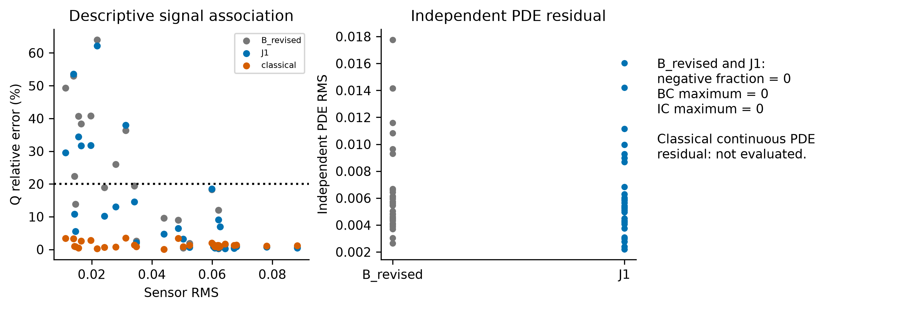

# Supplement: evidence and interpretation boundaries

## S1. Full distributions and paired effects

The [90-row table](generated/tables/all_final_runs.csv) retains every final scenario for every method. [Distribution summaries](generated/tables/distributions.csv) report mean, median, sample SD, quartiles, 90th percentile and worst value. Missing classical continuous-PDE diagnostics remain missing; a finite-difference field must not be assigned an autograd residual of zero.

The [paired table](generated/tables/paired_effects.csv) reports J1 minus each control. Negative error differences favor J1. The report-only bootstrap uses 10,000 paired resamples with seed 2009202818 and the same resampled indices for all metrics. These effects and intervals are independently reproduced from raw rows; the original [summary](evidence/final/summary.json) is preserved byte-for-byte. This is analysis reproduction, not a new hypothesis test, estimator or selection decision. Ties use the frozen tolerance.

**S1.** All final cases are retained in the sensor-signal scatter. The relation is descriptive, not a randomized causal experiment. Independent neural PDE diagnostics are shown separately from hard-constraint values. Exact BC/IC and nonnegativity do not certify accurate source recovery.

## S2. Historical evidence is not another final test set

| Experiment | Bundled evidence | Scientific role |
| --- | --- | --- |
| Numerical validation | [Convergence CSV](evidence/numerical/numerical_convergence.csv), [summary](evidence/numerical/validation_summary.json) | Numerical verification and estimated accuracy |
| Original B0 | [Initial summary](evidence/historical/initial_summary.json) | Development and then-consumed held-out evidence |
| Physical correction | [Independent comparison summary](evidence/historical/physical_correction_summary.json) | B0 versus B_revised; not pooled with final cases |
| Observability | [Diagnostic summary](evidence/observability/summary.json), [conditional Q](evidence/observability/conditional_Q_results.csv), [resolution study](evidence/observability/resolution_bias_results.csv) | Oracle and classical diagnostics, not final validation |
| Formulation intervention | [Candidate table](evidence/development/candidate_summary.csv), [selection record](evidence/development/summary.json) | 24-case development only; no B_revised_2 promotion |
| Final confirmation | [Raw J1](evidence/final/J1_raw.csv), [B_revised](evidence/final/B_revised_raw.csv), [classical](evidence/final/classical_raw.csv), [failed decision](evidence/final/decision.json) | 30 new cases; fixed recipes and failed final gate |

Original detailed reports remain available: [numerical validation](../docs/numerical_validation.md), [observability diagnosis](../docs/observability_diagnosis.md), [source/field derivation](../docs/source_field_coupling.md), [development intervention](../docs/inverse_formulation_revision.md), and [final confirmation](../docs/J1_confirmatory_results.md). These are historical records, not instructions to resume model development. Large historical diagnostic plots remain in their original local result directories; no unexecuted sweep is represented as evidence.

## S3. Field display selection

Before inspecting the display images, reporting selected the median localization rank among J1 joint recoveries (ascending localization, then ID; zero-based index floor(n/2)), giving **final_blind_v1_003**. Failure selection is maximum localization, then ascending ID, giving **final_blind_v1_030**. All four saved 161² preview frames are copied unchanged; main figures show the final time 0.8. This is an explicit reporting selection, not an originally preregistered inferential endpoint. Full 641² archived metrics, not downsampled display values, determine rankings and captions.

## S4. Numerical and statistical cautions

Final cases 016,017,027 have estimated reference errors 1.063%,1.184%,1.126%. All are retained in scores. The worst three localization cases (030,008,024) met the numerical target. Rejected hypotheses and failed recoveries are evidence, not missing data. The current report draws no noise, changed-wind, sensor-count, multiple-source or real-data performance conclusions from the existence of older software modules.

## S5. Bibliographic verification

References 2–5 were checked against their authors' arXiv records. Publisher-deposited title/author/date/abstract metadata for Golub–Pereyra were verified through [Crossref's DOI record](https://api.crossref.org/works/10.1137/0710036); the publisher page was access-blocked. Almaty reference 1 title/authors/pages/DOI were checked against [its publisher-deposited record](https://api.crossref.org/works/10.4209/aaqr.2019.09.0464); the full publisher page was access-blocked. It is used only for general motivating context, not quantitative pollution claims, licensing assumptions, or emitter attribution. No measurements were downloaded or scraped.
